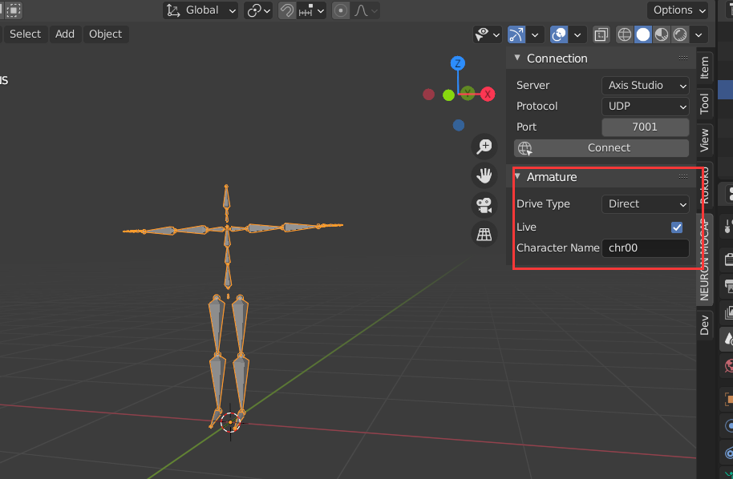
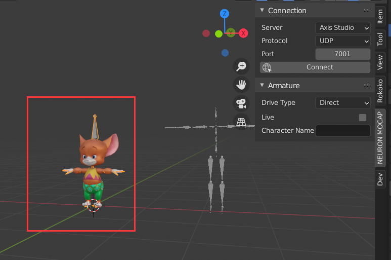
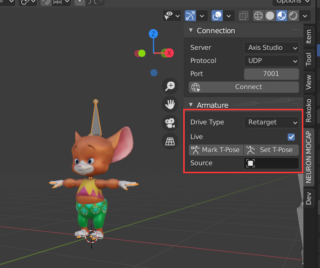
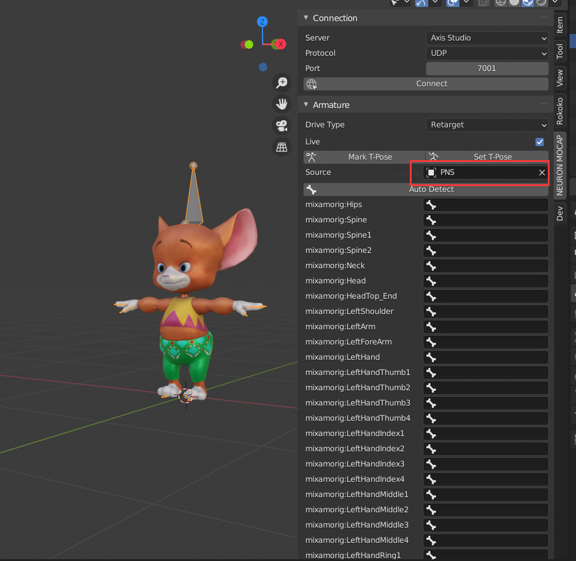
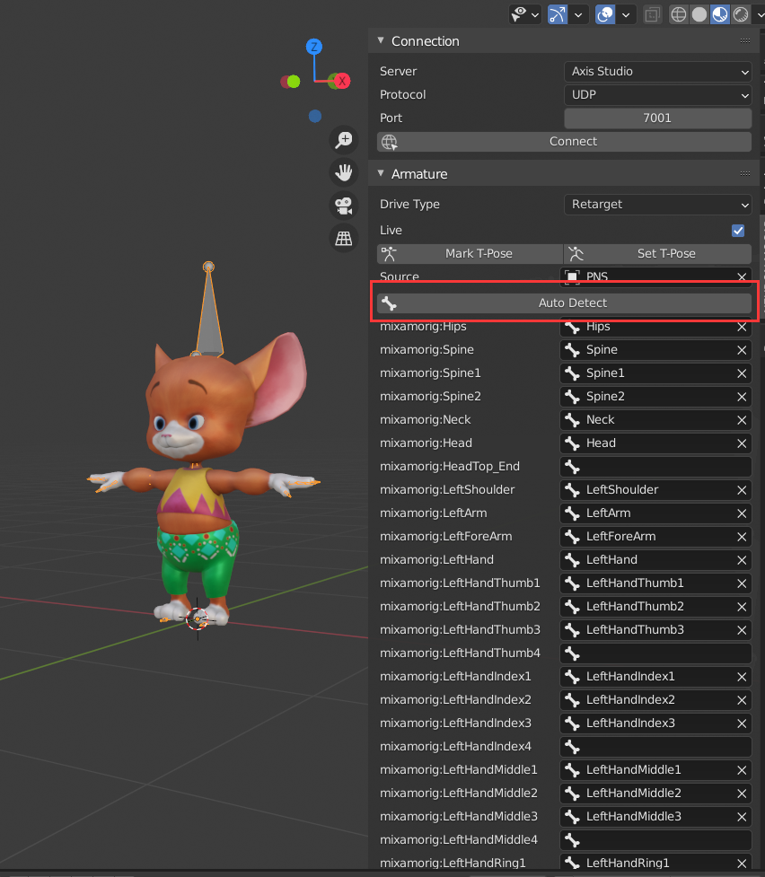
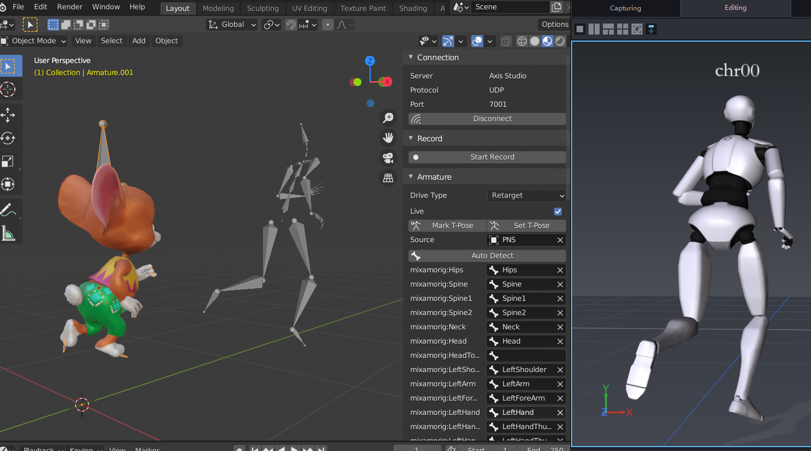

# 
NEURON MOCAP LIVE Plugin for Blender

This plugin provide the ability to stream motion data from Axis Studio into Blender.

## Requirement
- Blender 2.80 or higher
- Window x86_64 

## Features
- Build **Axis Studio/Axis Studio - Thumb Open/Axis Neuron (Pro)** armature 
- Live motion data
- Retarget motion data
- Record motion data

## Installation
1. Download the **neuron_mocap_live** folder, and copy it to your Blender addons path

   

2. Enable **Noitom:NEURON MOCAP LIVE** plugin in Blender
   
   

## Live Motion Data (Direct)
1. Add a **Axis Studio/Axis Studio - Thumb Open/Axis Neuron (Pro)** armature
   
   
   

2. Bind the armature with a mesh (optional)
   
   

3. Enable **BVH Broadcasting** settings in **Axis Studio**
 
   

4. Configure the live settings in **NEURON MOCAP** tab in sidebar in Blender
   
   - The **Server** settings within **Connection** catagory means how to parse stream data, if you want to animate **Axis Neuron(Pro)** armature, please switch the **Server** settings to **Axis Neuron / Pro**

   - The **Drive Type** settings within **Armature** catagory means how to drive the active armature, under the **Direct** option, the motion data received will directly pass to armature 

   

5. Click **Connect** to start live:
   
   

## Live Motion Data (Retarget)
1. Add a **Axis Studio/Axis Studio - Thumb Open/Axis Neuron (Pro)** armature and set the **Drive Type** settings to **Direct**

   

2. Import your character
    
   

3. Adjust your character's pose to **T-Pose**, and set the **Drive Type** to **Retarget**, check on **Live** option and click **Mark T-Pose** button

   

4. Set the **Source** armature to the armature you created at first step

   

5. Click **Auto Detect** try to auto match bones, if auto match failed at some bones, you can manually match these bones

   

6. Click **Connect** to start live:

   

## Record Motion Data

1. Click **Start Record** to start record during living, and click **Stop Record** to finish record
   
   
   

2. The data recorded is saved in an **Action** named "mocap"
   
   

3. The record frame rate is same as the scene frame rate

   
   

## Property Lock

**Neuron Mocap Plugin** animate an armature by animating bone's **Location/Rotaion/Scale** property, but in some scenario, only **Rotation** animation is required, you can do this by lock **Location** and **Scale** property **(this feature only available on direct drived armature)**

   
