# 
Neuron Mocap Live Plugin for Blender

This plugin provide the ability to stream motion data from Axis Studio into Blender.

## Requirement
- Blender 2.80 or higher
- Window x86_64 

## Features
- Build **PNS/PNS-Thumb Open/PN Pro** armature 
- Live motion data
- Record motion data

## Installation
1. Download the **neuron_mocap_live** folder, and copy it to your Blender addons path:

   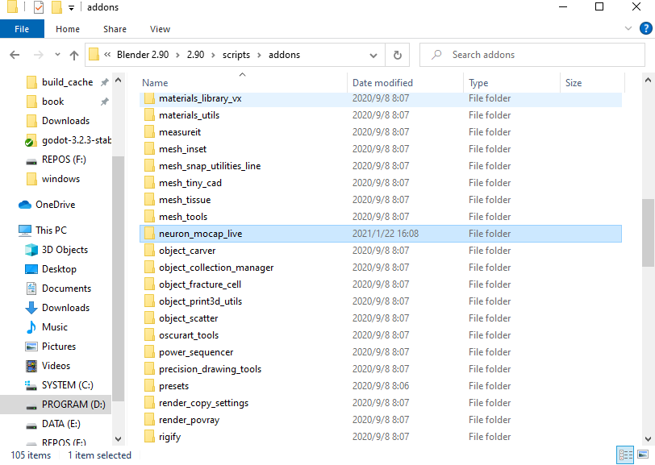

2. Enable **Noiton:Neuron Mocap Live** plugin in Blender:
   
   

## Live Motion Data
1. Add a **PNS/PNS-Thumb Open/PN Pro** armature:
   
   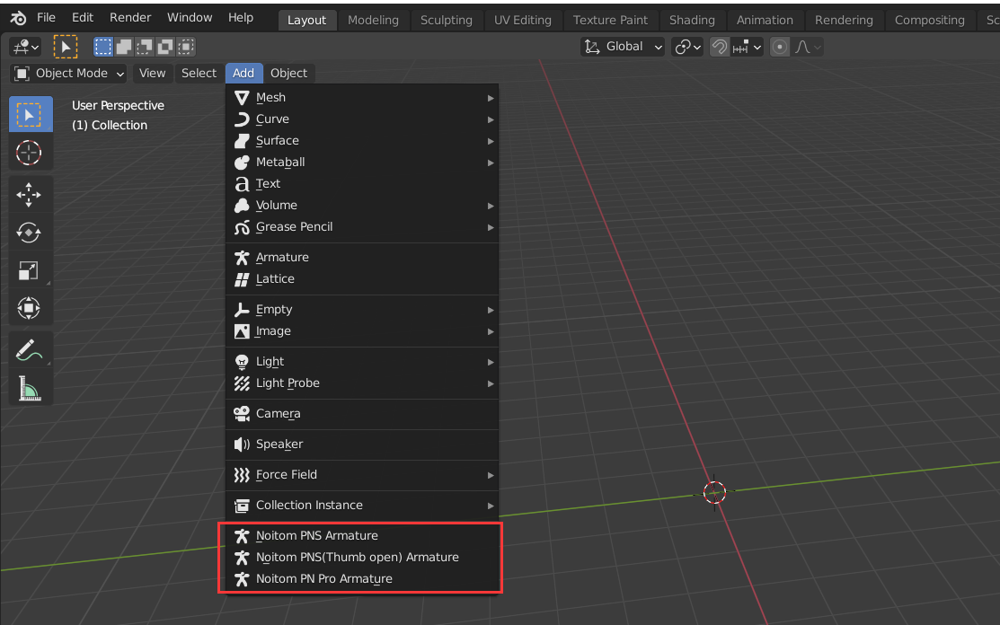
   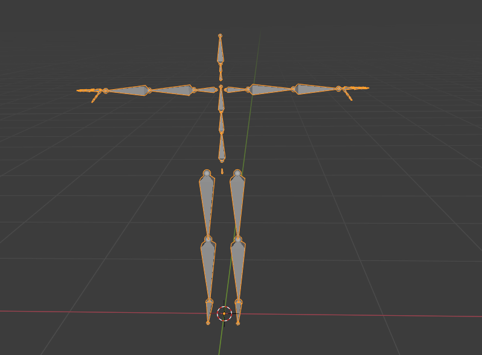

2. Bind the armature with a mesh:
   
   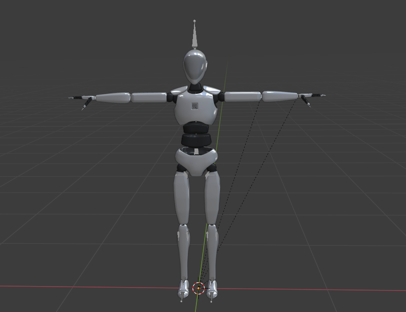

3. Enable **BVH Broadcasting** settings in **Axis Studio**:

   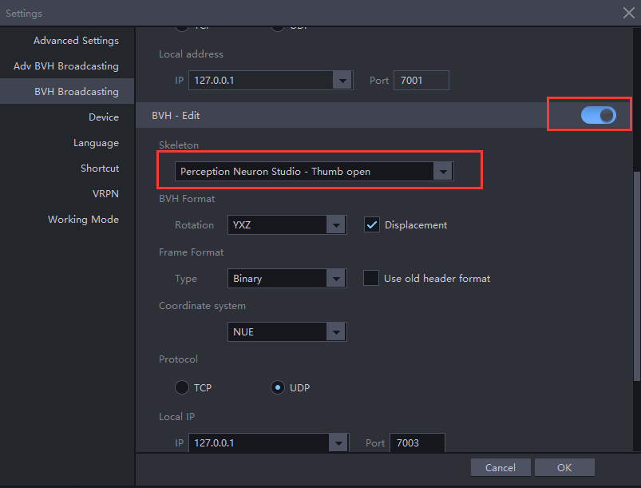

4. Configure the live settings in **Neuron Mocap** tab in sidebar in Blender:
   
   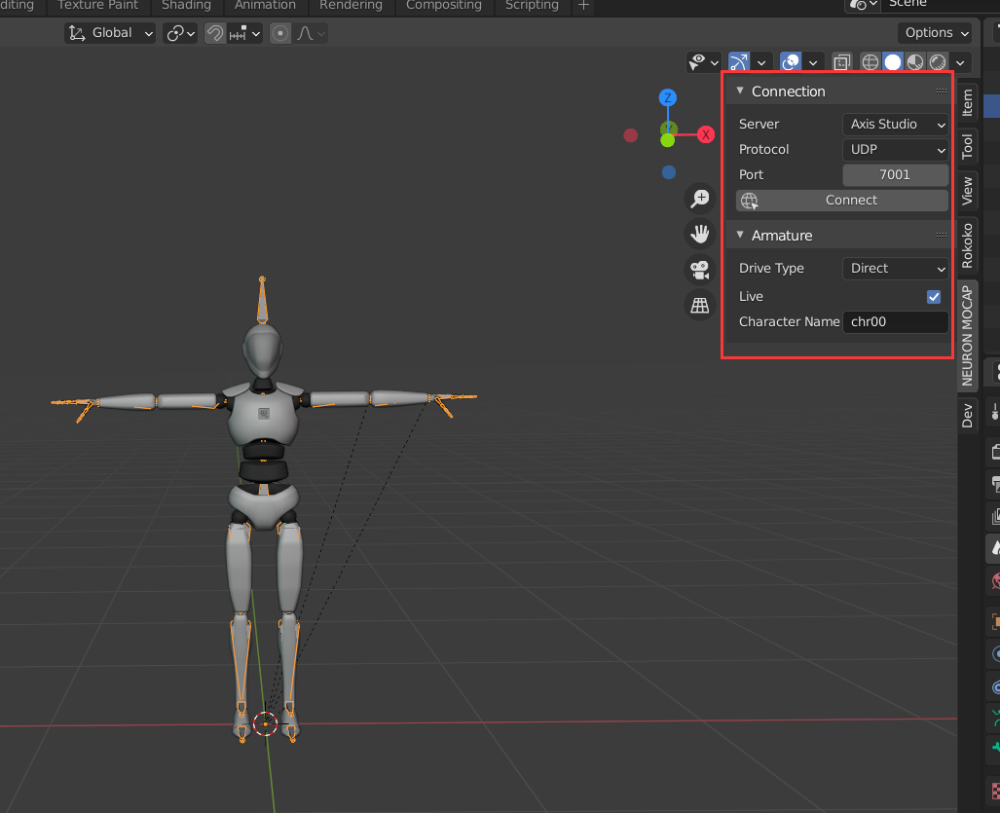

5. Click **Connect** to start live:
   
   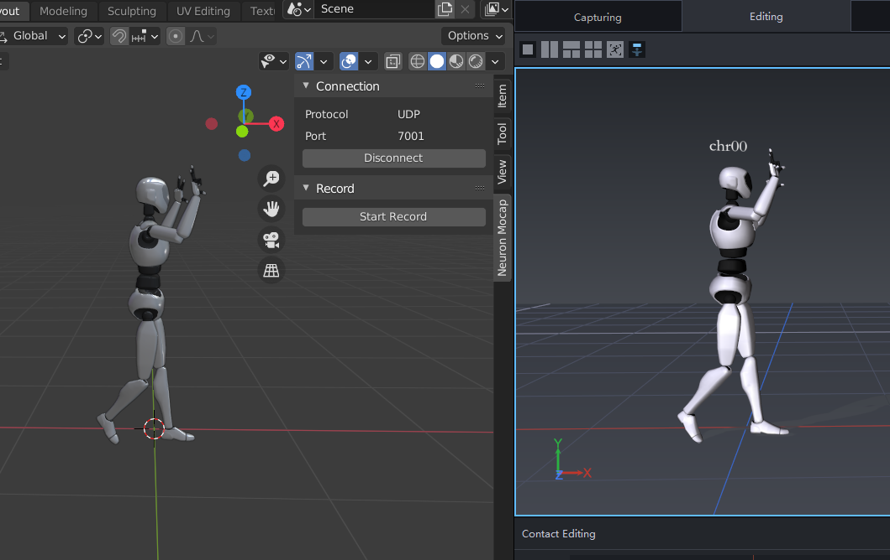

## Record Motion Data

1. Click **Start Record** to start record during living, and click **Stop Record** to finish record:
   
   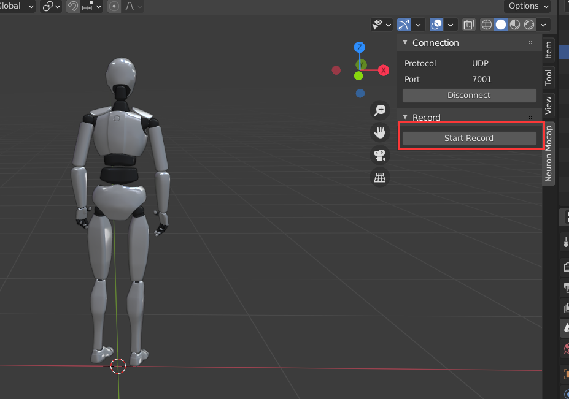
   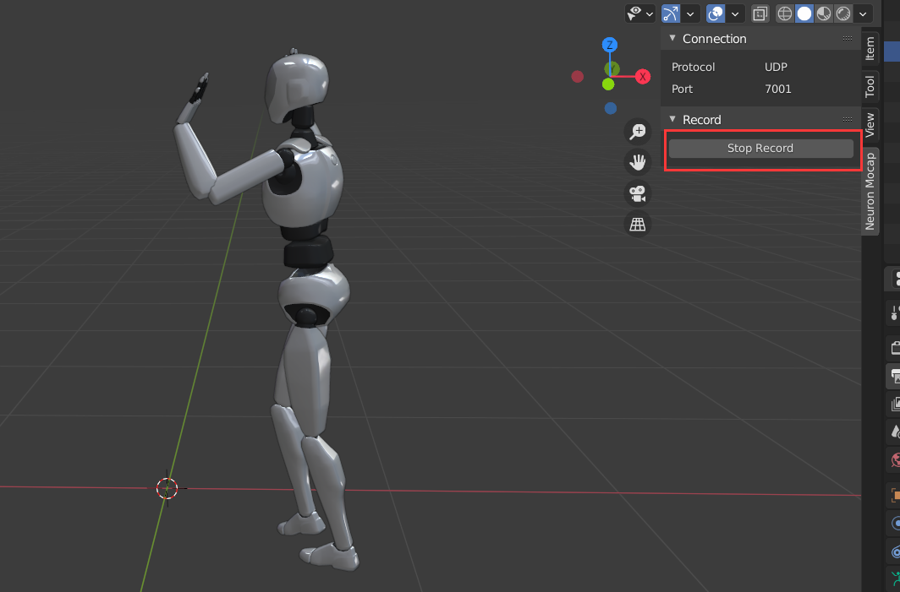

2. The data recorded is saved in an **Action** named "mocap":
   
   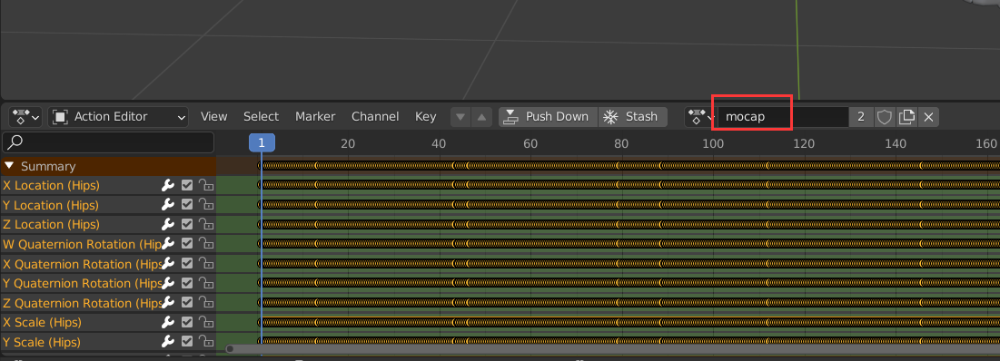

3. The record frame rate is same as the scene frame rate:

   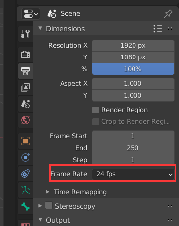
   

## Property Lock

**Neuron Mocap Plugin** animate an armature by animating bone's **Location/Rotaion/Scale** property, but in some scenario, only **Rotation** animation is required, you can do this by lock **Location** and **Scale** property:

   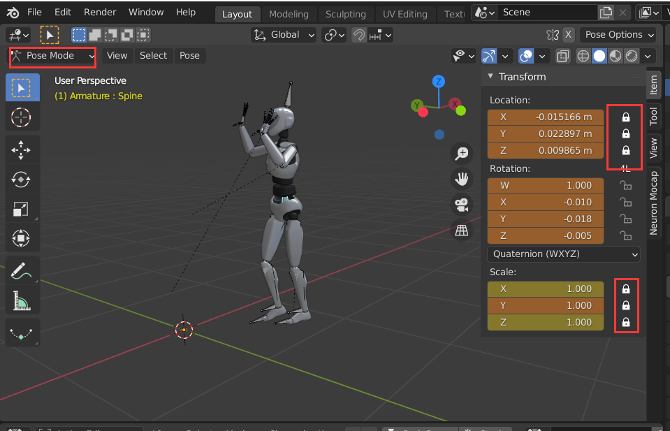